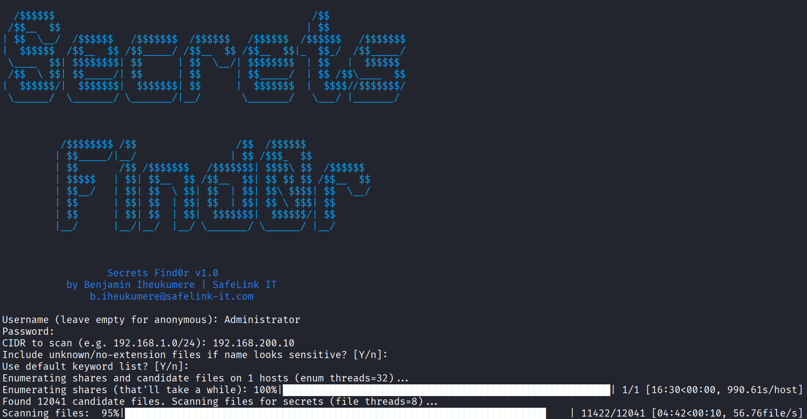
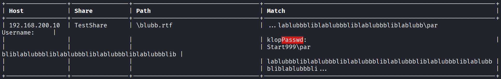

# Secrets Find0r

A powerful multi-threaded SMB-share explorer & credential/secret discovery tool. Search across SMB shares for exposed credentials, tokens, connection strings etc., with highlights in output and clean ASCII table exports.

---

## Features

* Recursive SMB share scanning with depth limit (configurable)
* File type filtering & keyword + regex-based secret detection (supports text, Office documents, PDFs, unknown/no-extension with name hints)
* Multithreading: separate pools for enumeration and file scanning
* Proper closing of connections to avoid resource leaks
* Configurable parameters: threads, timeouts, max directory depth
* Auth Modes: NTLM (password or NT hash) & **Kerberos** (kinit cache or password/hash)
* Admin share exclusions** by default (`ADMIN$`, `IPC$`, drive shares like `C$`, …)
* Token-level highlighting** on screen (only the matched word/phrase is colored)
* File formats: txt/csv/json/html/rtf/log/xml/yaml/ps1, **docx/xlsx/pptx**, **doc/xls/ppt (OLE)**, **PDF**, **eml/msg E-Mail files**
* Multithreaded enumeration & scanning, **configurable** performance knobs
* Depth-limited recursion to avoid massive traversals
* Plain ASCII report saved to `USERNAME_secrets_found_YYYYMMDD_HHMMSS.txt`

---

## Installation

1. Clone the repo:

   ```
   git clone https://github.com/YourUsername/secrets_find0r.git
   cd secrets_find0r
   ```
2. Install dependencies:

   ```
   pip install -r requirements.txt
   ```
   
3. Make script executable if needed:

   ```
   chmod +x secrets_find0r.py
   ```

---

## Usage
You can run **interactively** (prompts) or **fully by CLI** (scriptable). Missing values are prompted interactively; performance defaults are used unless overridden.

### Interactive
```bash
python secrets_find0r.py
```
You’ll be asked for:
- Username (empty = anonymous)
- **Authentication**: NTLM or Kerberos  
  - Kerberos: provide **DOMAIN** and **KDC/DC FQDN** (must resolve or be in `/etc/hosts`).  
    The supplied DC **FQDN is auto-used as SPN** target (`cifs/<FQDN>`).
- CIDR to scan (e.g., `192.168.1.0/24`)
- Include unknown/no-ext files if names look sensitive? (Y/n)
- Use default keyword list or provide your own

### CLI (all options)

**Auth & identity**
```
--cidr CIDR
--username USER
--password PASS
--hash NTHASH                 # 32 hex chars; LM not required
--domain DOMAIN               # required for Kerberos
--kerberos                    # enable Kerberos (instead of NTLM)
--kdc FQDN                    # KDC/DC FQDN (resolvable or in /etc/hosts); also used as SPN cifs/<FQDN>
--use-cache                   # use Kerberos ticket cache (kinit)
```

**Keywords & candidate selection**
```
--include-unknown             # include unknown/no-ext files if name looks sensitive
--no-default-keywords         # do not load built-in keyword list
--keywords "k1,k2,..."        # custom list; merged unless --no-default-keywords
```

**Performance & limits**
```
--threads-enum INT            # default 32
--threads-files INT           # default 8
--max-file-bytes INT          # default 4194304 (4 MiB)
--max-unknown-bytes INT       # default 262144 (256 KiB)
--max-dir-depth INT           # default 2 (root '\' = 0)
--port-probe-timeout FLOAT    # default 0.5
--smb-connect-timeout FLOAT   # default 5
--smb-op-timeout FLOAT        # default 5
```

> **Note (Kerberos):** `--kdc` must be a **FQDN** and resolvable. The same value is used as SPN target. Consider `kinit user@REALM` + `--use-cache` for smoother auth.

---

## Screenshot of Secrets Find0r in action


---

## 📚 Examples

**NTLM (password)**
```bash
python secrets_find0r.py \
  --cidr 10.10.20.0/24 \
  --username corp\\j.doe \
  --password 'S3cr3t!' \
  --threads-enum 64 --threads-files 12 \
  --max-dir-depth 3
```

**NTLM (NT hash)**
```bash
python secrets_find0r.py \
  --cidr 10.0.0.0/23 \
  --username CORP\\svc.scan \
  --hash 5f4dcc3b5aa765d61d8327deb882cf99
```

**Kerberos (using kinit cache)**
```bash
kinit user@CORP.LOCAL
python secrets_find0r.py \
  --cidr 192.168.56.0/24 \
  --kerberos --use-cache \
  --domain CORP.LOCAL \
  --kdc dc01.corp.local
```

**Kerberos (with password)**
```bash
python secrets_find0r.py \
  --cidr 172.16.1.0/24 \
  --kerberos \
  --domain CORP.LOCAL \
  --kdc dc01.corp.local \
  --username user.name \
  --password 'CorrectHorseBatteryStaple'
```

**Include unknown/no-ext & custom keywords (merge with defaults)**
```bash
python secrets_find0r.py \
  --cidr 10.1.2.0/24 \
  --username corp\\auditor \
  --password 'Audit-2025!' \
  --include-unknown \
  --keywords "client_secret,oauth,token,privatekey"
```

**Only custom keywords**
```bash
python secrets_find0r.py \
  --cidr 10.2.3.0/24 \
  --username corp\\redteam \
  --password 'Xx!xX' \
  --no-default-keywords \
  --keywords "db_password,sa_password,connectionstring"
```

**Tune performance/timeouts**
```bash
python secrets_find0r.py \
  --cidr 192.168.100.0/24 \
  --username corp\\ops \
  --password 'ops!' \
  --threads-enum 96 --threads-files 16 \
  --port-probe-timeout 0.3 \
  --smb-connect-timeout 8 \
  --smb-op-timeout 8 \
  --max-file-bytes 6291456 \
  --max-dir-depth 4
```

---

## 🧪 Output

- **Screen:** ANSI-colored table — only the matched tokens are highlighted (red background).  
- **File:** Plain ASCII table (no ANSI), saved to e.g. `user_secrets_found_YYYYMMDD_HHMMSS.txt`.

Sample (screen):
```
+-----------------+-----------+-------------------------------------------+-------------------------------+
| Host            | Share     | Path                                      | Match                         |
+-----------------+-----------+-------------------------------------------+-------------------------------+
| 192.168.1.23    | Finance   | \budgets\2025\costs.txt                   | ... db=prod; user=sa; pass=██ |
+-----------------+-----------+-------------------------------------------+-------------------------------+

* Console output: aligned ASCII table, matched tokens highlighted with red background
* File output: plain ASCII table, no color codes
* Example filename:
```
  ```
  userX_secrets_found_20250917_123456.txt
  ```
* Contents: columns: `Host | Share | Path | Match`


---

## Notes

* SMB shares that deny listPath or have tight permissions may hide files; may need sufficient permissions
* Deep directory trees may be large; `MAX_DIR_DEPTH` setting helps prevent runaway recursion.
* Large files truncated by `MAX_FILE_BYTES` setting
* Parser availability (PDF, legacy Office) depends on installed optional libraries (`PyPDF2`, `olefile`)
* Exclusions:** Admin/system shares are skipped by default (`ADMIN$`, `IPC$`, drive shares like `C$`, `D$`, ...).  
* Kerberos `KDC_ERR_S_PRINCIPAL_UNKNOWN`:** Usually the target SPN isn’t found. Verify:
* FQDN** correctness & DNS/hosts resolution
* Domain/realm** matches
  - The **SPN exists** on the target (e.g., `setspn -Q cifs/server.domain.tld`)
  - Try `kinit user@REALM` and run with `--use-cache`
* Depth:** `--max-dir-depth` controls recursion (root `\` = 0). Increase if needed, but expect more files.

---

## Modification

* To change number of threads: adjust `THREADS_ENUM` and `THREADS_FILES` in the configuration section
* To adjust timeouts, file size caps, directory depth: modify corresponding constants at top of script
* To add new keywords or extensions: edit `KEYWORDS`, `SUPPORTED_EXTS`, `REGEX_PATTERNS`

---

## 📦 Requirements

- Python **3.8+**
- Required: `impacket`, `tqdm`
- Optional (recommended): `olefile`, `PyPDF2`

Install quickly (recommended virtual env):
```bash
python3 -m venv .venv && source .venv/bin/activate
pip install -r requirements.txt
```

## Disclaimer

Use only in environments where you have explicit authorization. The author is not responsible for misuse.

---
